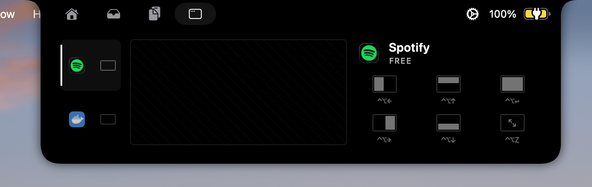

<h1 align="center">
  <br>
  
  <br>
  Gojo
  <br>
</h1>

<p align="center">
  <em>Turn the MacBook notch into a control surface for everything you actually use.</em>
</p>

<p align="center">
  <a href="https://github.com/rohoswagger/gojo/releases/latest"></a>
  <a href="https://github.com/rohoswagger/gojo/actions/workflows/build.yml"></a>
  <a href="./LICENSE"></a>
  
</p>

<p align="center">
  
</p>

---

Gojo expands the dead space around your MacBook's notch into a focused, tab-driven HUD. Music, clipboard history, a drag-and-drop file shelf, and a window manager — all on top of the system you already know, accessed by hovering the notch.

## Replaces

Gojo is one app that handles what you'd otherwise need several for:

| Instead of | What Gojo gives you |
|------------|---------------------|
| [Rectangle](https://rectangleapp.com/) / Magnet | Window snapping (halves, fill, zoom) with a stage strip of on-screen apps and live monitor preview — every action is cross-app and rebindable |
| [Maccy](https://maccy.app/) / Paste | Clipboard history with search, pinning, and paste-back to the focused app |
| [boring.notch](https://github.com/TheBoredTeam/boring.notch) | The notch UI baseline Gojo evolved from — now with substantially more modules and original product work on top |
| Various menu bar utilities | Brightness / keyboard-backlight / volume HUDs, a drag-and-drop file shelf, now-playing controls for Music/Spotify/browser audio, calendar context, webcam mirror — all in one place |

One app, one notch, one set of keyboard shortcuts. No menu-bar clutter.

## Features

### 🪟 Window snapping

Stage strip of on-screen apps with real app icons, a live monitor preview, and six snap actions (left / right / top / bottom halves, fill, zoom). Cross-app: click any window, snap it. Every chip surfaces its keyboard shortcut underneath.

<p align="center"></p>

### 🎵 Music

Now-playing surface that follows whatever's playing — Apple Music, Spotify, browser audio. Scrubs, switches, and renders artwork in the notch's album-art slot.

<p align="center"></p>

### 📋 Clipboard history

Recent clipboard items, browsable from the notch. Pin entries, search, paste back into the focused app.

<p align="center"></p>

### 📦 Drag-and-drop shelf

Drop files into the notch from anywhere; pick them up later from any other app. Lightweight staging without a Finder tab open.

<p align="center"></p>

### 🔆 HUD controls

Brightness, keyboard backlight, and volume sneak peeks render inline instead of taking over the screen.

<p align="center"></p>

### 📷 Webcam mirror

Quick selfie view for camera-positioning before a call.

<p align="center"></p>

### 📅 Calendar context

Next-up event glanceable when the notch opens.

> Screenshots not yet committed render broken in this README — see [`docs/screenshots/README.md`](./docs/screenshots/README.md) for the expected filenames and capture conventions.

## Install

> Requires macOS 14 Sonoma or later. Apple Silicon and Intel both supported.

### Latest release

Download the DMG from [the latest release](https://github.com/rohoswagger/gojo/releases/latest), drag **Gojo.app** to `/Applications`.

If macOS blocks first launch with a quarantine warning:

```bash
xattr -dr com.apple.quarantine /Applications/Gojo.app
```

Updates are delivered automatically via [Sparkle](https://sparkle-project.org/) — Gojo checks the [appcast](https://rohoswagger.github.io/gojo/appcast.xml) periodically.

### Build from source

```bash
git clone https://github.com/rohoswagger/gojo.git
cd gojo
make run
```

`make run` builds the Debug app, stops any existing dev process, and launches it. Other useful targets:

| Command | Effect |
|---------|--------|
| `make build` | Build only |
| `make stop` | Kill running dev instances |
| `make restart` | Stop + build + launch |
| `make smoke` | Build + launch + sanity check |
| `make test-window` | Window management regression tests |
| `make test-window-ui` | Windows tab UI regression checks |
| `make test-window-focus` | Focused-window provider regression |
| `make clean` | Remove `.build/` artifacts |

You can also open `Gojo.xcodeproj` in Xcode and run normally.

## Permissions

Gojo asks for a few macOS permissions on first use of the relevant feature:

| Permission | Why |
|------------|-----|
| **Accessibility** | Required for the window manager — read and resize windows of other apps via AX. |
| **Apple Events** | Reading the now-playing track from Music/Spotify. |
| **Camera** | Optional, for the webcam mirror. |

Permissions are granted via **System Settings → Privacy & Security**. The `GojoXPCHelper` XPC service is the process that holds the Accessibility grant — Gojo proxies AX-trusted work through it.

## Keyboard shortcuts

Defaults — all rebindable in **Settings → Shortcuts**.

### Global

| Action | Shortcut |
|--------|----------|
| Open clipboard history panel | ⇧⌘C |
| Toggle notch open | ⇧⌘I |
| Toggle sneak peek | ⇧⌘H |
| Toggle microphone | fn-F5 |
| Decrease keyboard backlight | ⌘F1 |
| Increase keyboard backlight | ⌘F2 |

### Window manager

| Action | Shortcut |
|--------|----------|
| Snap to left half | ⌃⌥← |
| Snap to right half | ⌃⌥→ |
| Snap to top half | ⌃⌥↑ |
| Snap to bottom half | ⌃⌥↓ |
| Maximize (fill) | ⌃⌥↩ |
| Zoom (default size) | ⌃⌥Z |

## Architecture

Gojo is two targets that talk over XPC:

- **`Gojo.app`** — the SwiftUI host app. Owns the notch window, the views, music/clipboard/shelf/webcam managers, and most of the UI logic.
- **`GojoXPCHelper.xpc`** — bundled XPC service. Holds the Accessibility authorization and performs AX-trusted operations (window enumeration, raise, frame set, zoom). Isolating AX in a separate process makes the trust model cleaner and lets the main app run without elevated permissions.

Auto-update is provided by Sparkle via the appcast at `https://rohoswagger.github.io/gojo/appcast.xml` (EdDSA-signed updates).

## Troubleshooting

**Window snaps aren't moving the right window**
Open **System Settings → Privacy & Security → Accessibility**, make sure **Gojo** is checked. The window manager talks through the helper, which needs AX trust.

**Clipboard history isn't capturing**
Gojo only sees changes while it's running. Launch Gojo first, then copy. If you toggle **Launch at login** in Settings, history starts being captured at boot.

**Notch doesn't show on a connected display**
Settings → General → Display lets you pick which screen Gojo lives on, and whether to mirror it across all displays.

**App is blocked on first launch**
macOS quarantine; run `xattr -dr com.apple.quarantine /Applications/Gojo.app` and re-open.

## Contributing

See [CONTRIBUTING.md](./CONTRIBUTING.md). Issues and PRs welcome — please search existing issues first.

## Security

See [SECURITY.md](./SECURITY.md) for the responsible-disclosure flow.

## License & provenance

Gojo is **GPLv3**, derived from [`boring.notch`](https://github.com/TheBoredTeam/boring.notch) by TheBoredTeam, with substantial original product, UI, and module work on top.

- License — [GPLv3](./LICENSE)
- Provenance — [NOTICE.md](./NOTICE.md)
- Third-party — [THIRD_PARTY_LICENSES](./THIRD_PARTY_LICENSES)

If you redistribute modified binaries you are responsible for preserving GPL notices and source-availability obligations for your distribution.

## Acknowledgments

Built on Sparkle, KeyboardShortcuts, Defaults, swift-collections, Lottie, Pow, SkyLightWindow, MacroVisionKit, AsyncXPCConnection, swiftui-introspect, LaunchAtLogin, and the original boring.notch work that gave this project its starting shape.
