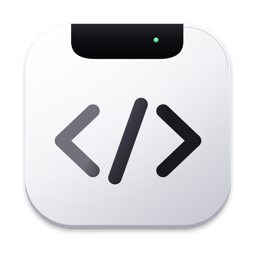
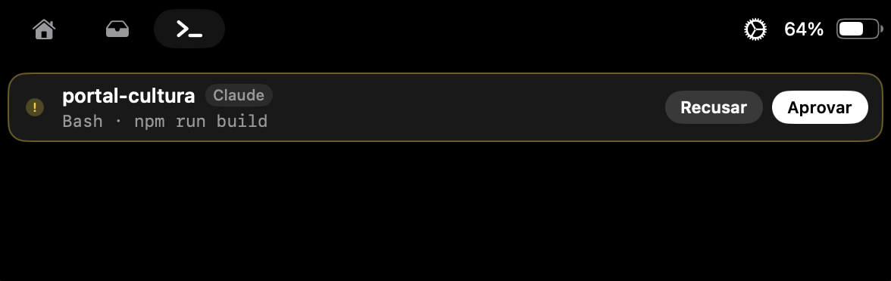

<p align="center">
  
</p>

<h1 align="center">boringCode</h1>

<p align="center">
  O notch do seu MacBook para quem programa com IA.<br>
  Música, calendário e shelf do <a href="https://github.com/TheBoredTeam/boring.notch">Boring Notch</a> — e agora seus agentes do Claude Code bem ali em cima.
</p>

<p align="center">
  <br>
  
</p>

---

## O que é

O **boringCode** é um fork do [Boring Notch](https://github.com/TheBoredTeam/boring.notch) que mantém tudo o que ele já faz
(player de música com espectro, calendário, shelf de arquivos, espelho, OSD de volume/brilho) e adiciona um
**módulo de agentes de IA**, inspirado no [Open Island](https://github.com/Octane0411/open-vibe-island).

Roda lado a lado com o Boring Notch original — é outro app (`com.reesoousa.boringcode`).

## Agentes de IA no notch

Funciona com o **Claude Code** no Terminal/iTerm, na **extensão do Claude para VS Code** (e Cursor) e no **app Claude**.

| Situação | Notch fechado |
|---|---|
| Só música | capa do álbum à esquerda, espectro à direita (como no Boring Notch) |
| Música + agente | música à esquerda; **status do agente no lugar do espectro** |
| Só agente | status geral à esquerda, **um quadradinho por sessão** à direita |

Status: ✻ rodando · **!** precisa de aprovação · **?** pergunta para você · ✓ concluído · ✕ erro.

- **Passe o mouse do lado do agente** (à direita do notch) e ele abre direto na aba **Agentes**.
- **Aprovar ou recusar** comandos sem sair do que você está fazendo — o notch se abre sozinho quando chega um pedido.
- **Responder perguntas** do Claude (múltipla escolha ou texto livre) no próprio notch.
- **Clique na sessão** para voltar à aba certa do Terminal/iTerm ou à janela do VS Code.
- **Som sutil** quando um agente termina (dá para trocar o som ou desligar).

### Como funciona

Ao abrir, o boringCode adiciona hooks em `~/.claude/settings.json` (salvando um backup antes e **sem mexer nos hooks
de outras ferramentas**). Cada hook chama um script local que conversa com o app por um socket em
`~/Library/Application Support/boringCode/`. Nada sai do seu Mac.

Se o boringCode estiver fechado, os hooks não fazem nada e o Claude segue normal. Para remover: **Ajustes › Agentes de IA › Remover hooks**.

## Compartilhar com Android e Windows (LocalSend)

Se o [LocalSend](https://localsend.org) estiver instalado, ele aparece como opção em
**Ajustes › Shelf › Quick Share Service**, logo depois do AirDrop (que continua sendo o padrão).
Solte arquivos no botão de compartilhar do shelf e o LocalSend abre com eles prontos para enviar.

## Instalação

> Um instalador `.dmg` está a caminho. Por enquanto, compile a partir do código.

Requisitos: macOS 14+, Xcode 16+.

```bash
git clone -b dev https://github.com/reesoousa/boring.notch.git boringCode
cd boringCode
xcodebuild -project boringNotch.xcodeproj -scheme boringNotch -configuration Release \
  -derivedDataPath build -destination 'platform=macOS,arch=arm64' build
open build/Build/Products/Release/boringCode.app
```

Na primeira vez que você clicar numa sessão do Terminal/iTerm, o macOS pede permissão de automação — é o que
permite focar a aba certa.

## Configurações

**Ajustes › Agentes de IA** (tudo ligado por padrão):

- Monitorar agentes de IA
- Indicador de status no notch fechado
- Passar o mouse no indicador abre a aba Agentes
- Abrir o notch quando um agente pedir aprovação
- Som ao concluir (e qual som)
- Status da conexão com o Claude Code, instalar/remover hooks

## Roadmap

- [x] Claude Code (terminal, VS Code, app Claude)
- [x] Aprovar/recusar e responder perguntas no notch
- [x] LocalSend no shelf
- [x] Codex
- [ ] Instalador `.dmg` assinado
- [x] Ícone próprio

## Créditos e licença

- [Boring Notch](https://github.com/TheBoredTeam/boring.notch), do TheBoredTeam — a base de todo o app e do design.
  O README original está em [`docs/README-boring-notch.md`](docs/README-boring-notch.md).
- [Open Island](https://github.com/Octane0411/open-vibe-island), de Octane0411 — referência para a integração com agentes
  (ponte por hooks, fluxo de aprovação, foco no terminal, layout do notch fechado).

Distribuído sob a [GPL-3.0](LICENSE), a mesma licença dos dois projetos.
