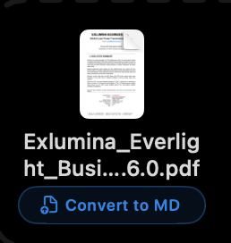
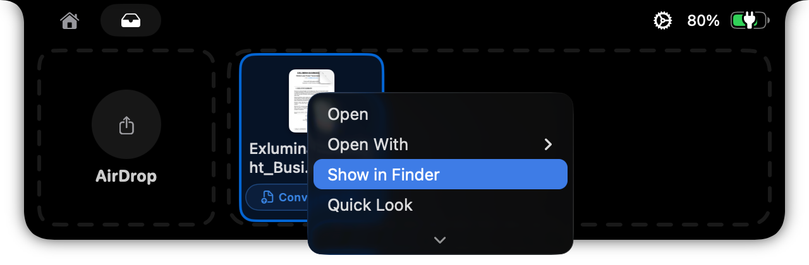

# Local MarkItDown Runtime

Boring Notch can convert supported shelf files into separate Markdown files
without sending document content to a cloud service. The integration uses the
unmodified `markitdown` 0.1.7 Python package from Microsoft.



The conversion control is shown only for supported non-Markdown files. Existing
file interactions and the full native context menu remain available.



## Supported files

The conversion button is shown for these non-Markdown file extensions:

- Documents: `.pdf`, `.docx`, `.pptx`, `.epub`, `.msg`
- Spreadsheets and data: `.xlsx`, `.xls`, `.csv`, `.json`, `.jsonl`
- Web and structured text: `.html`, `.htm`, `.xml`, `.rss`, `.atom`
- Archives and text: `.zip`, `.txt`, `.rst`, `.log`

`.md` and `.markdown` can be handled by the wrapper but intentionally do not
show a conversion button because they are already Markdown.

Audio transcription, YouTube, Azure Document Intelligence, LLM-based image
descriptions, third-party plugins, and remote URL conversion are not included.

## Local-only architecture

1. The Swift service accepts file URLs with an explicitly supported extension.
2. It copies the source into a unique temporary input directory. The source is
   never passed as an output path.
3. The bundled helper calls `MarkItDown(enable_plugins=False).convert_local()`.
4. The helper removes proxy variables and replaces Python socket connection
   entry points with functions that fail closed.
5. Markdown is written atomically to a separate temporary file and added to the
   shelf. Dragging it to Finder uses an `NSFilePromiseProvider` copy operation,
   which does not overwrite an existing destination.

This boundary applies to conversion only. Boring Notch has unrelated features
with their own existing network behavior.

## Reproducible runtime build

The generated runtime is not committed to Git. Build it on the target Mac so
PyInstaller selects the correct host architecture:

```bash
brew install python@3.13
./scripts/build_markitdown_runtime.sh
```

The current verification record covers Apple Silicon. The same pinned build is
intended to run on Intel macOS, but its wheel availability, packaging, and
Release integration should be confirmed on an Intel CI runner or maintainer Mac
before publishing an Intel binary.

The build requires CPython 3.13.15, installs the exact package versions in
`requirements/markitdown-runtime.txt` with `--no-deps`, runs `pip check`, and
packages an onedir helper with PyInstaller. It then signs every bundled Mach-O
file ad hoc and replaces only `boringNotch/vendor/markitdown-runtime`.

To use another CPython 3.13.15 installation, set `PYTHON_COMMAND` and, if its
license cannot be discovered, `PYTHON_LICENSE`:

```bash
PYTHON_COMMAND=/path/to/python3.13 \
PYTHON_LICENSE=/path/to/CPython/LICENSE \
./scripts/build_markitdown_runtime.sh
```

`ALLOW_UNPINNED_PYTHON=1` exists only for an intentional lock refresh. Release
artifacts should not use it.

## Verification

Run the wrapper unit tests and real PDF/DOCX integration tests:

```bash
./scripts/test_markitdown_runtime.sh
```

The test verifies:

- packaged PDF conversion;
- packaged DOCX conversion;
- byte-for-byte source preservation;
- refusal of remote URL input;
- Python socket denial and proxy removal;
- sandbox-safe MIME initialization;
- rejection of identical input and output paths.

Build the app in Release configuration:

```bash
xcodebuild \
  -project boringNotch.xcodeproj \
  -scheme boringNotch \
  -configuration Release \
  -derivedDataPath build/UpstreamDerivedData \
  CODE_SIGNING_ALLOWED=NO \
  build
```

## Licensing and distribution

Boring Notch remains GPL-3.0. The MarkItDown runtime is a bundled aggregate of
CPython, MarkItDown, its conversion dependencies, and PyInstaller support.
`THIRD_PARTY_LICENSES_MARKITDOWN` is generated from the exact lock and installed
distribution license files, and is copied into every generated runtime.

MarkItDown 0.1.7 is used unmodified under the MIT License:

> Copyright (c) Microsoft Corporation.

Binary distributors must include the Boring Notch GPL-3.0 license, the runtime
notices, corresponding source for GPL-covered modifications, and these build
instructions. The build process installs MarkItDown from PyPI and does not fork
or modify Microsoft’s repository.
